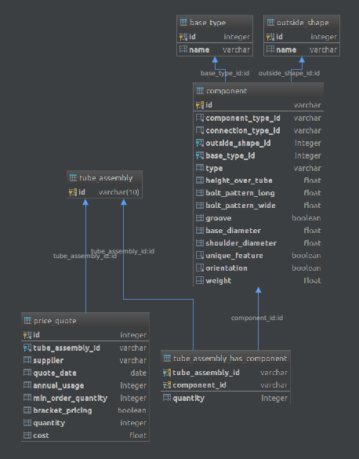

Instalando o projeto
---

    pip install -r requirements.txt

Criando todas as tabelas necessárias
---

    python3.6 -m cognitivo.scripts.create_database

Manipulando dados de comp_boss.csv
---

    python3.6 -m cognitivo.scripts.comp_boss

Manipulando dados de bill_of_materials.csv
---

    python3.6 -m cognitivo.scripts.bill_of_materials

Manipulando dados de price_quote.csv
---

    python3.6 -m cognitivo.scripts.price_quote

Modelo de dados final
---

